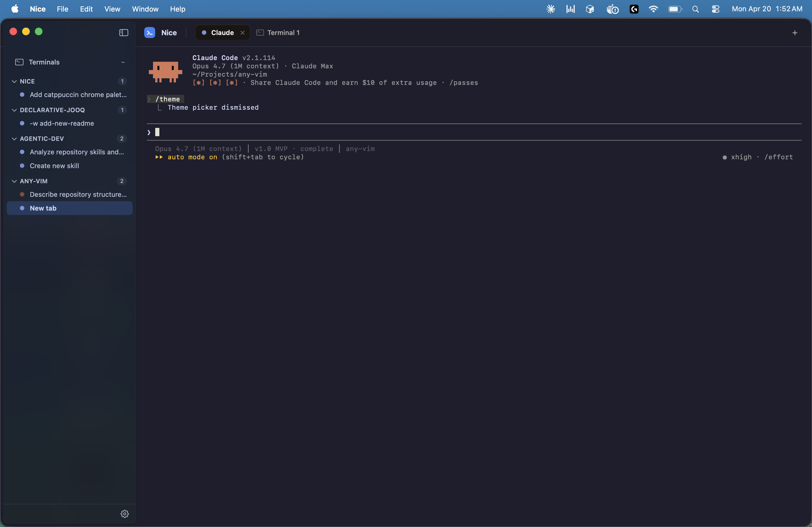
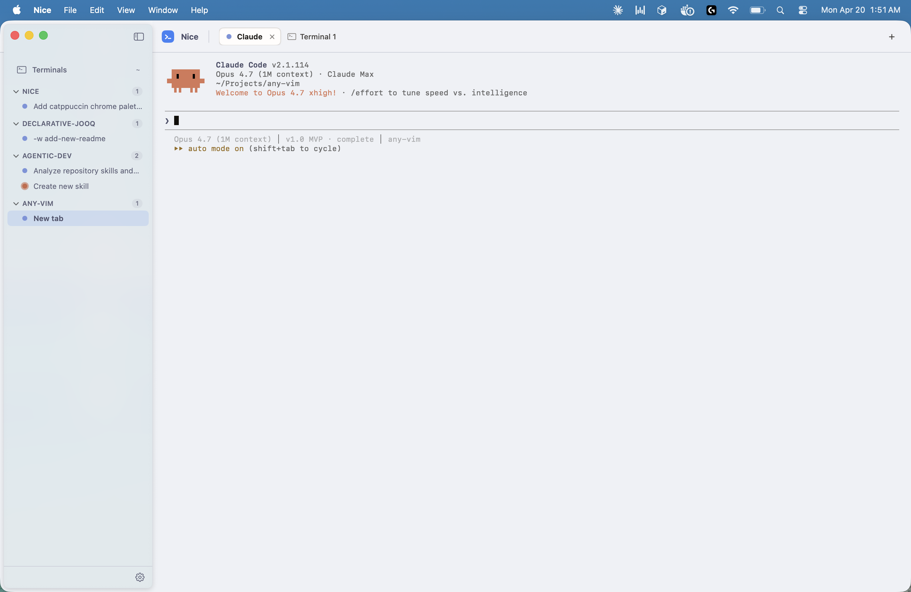

# This is Nice

> **Never lose track of a Claude session again.**

A native macOS terminal that organizes your Claude Code sessions for you. Run `claude` anywhere — Nice spawns it in a fresh pty and files it under the right project in the sidebar. No config, no setup, no "where did that window go" dance.

```sh
brew install --cask Nick-Anderssohn/nice/nice
```

<p align="center">
  
</p>

## Auto-organized sessions

You don't organize your Claude sessions. Nice does.

Type `claude <args>` in any shell, from any project directory — a new tab opens in Nice, auto-grouped under the right project, running in its own long-lived pty with a plain `zsh` pane alongside.

## The themes are lit 🔥

Twelve built-in terminal themes — Catppuccin (all four), Dracula, Nord, Gruvbox, Tokyo Night, Solarized, Atom One, and more — plus five native-chrome accents (Terracotta, Ocean, Fern, Iris, Graphite). Switch live from Settings; the whole window repaints instantly. OS Theme Sync is supported.

Already have a [Ghostty](https://ghostty.org) theme you love? Nice reads Ghostty's theme file format directly. Drop it in and it's a one-click swap.

<table>
  <tr>
    <td width="50%"></td>
    <td width="50%"></td>
  </tr>
  <tr>
    <td align="center"><sub><b>Catppuccin Latte</b></sub></td>
    <td align="center"><sub><b>Catppuccin Mocha</b></sub></td>
  </tr>
</table>

## Keyboard-first

| Shortcut | Action |
|---|---|
| `⌘⌥↓` / `⌘⌥↑` | Next / previous sidebar tab |
| `⌘⌥→` / `⌘⌥←` | Next / previous pane within a tab |
| `⌘T` | New terminal pane |
| `⌘B` | Toggle sidebar |
| `⌘+` / `⌘-` / `⌘0` | Zoom in, out, reset |

All rebindable in Settings (`⌘,`).

## Requirements

- macOS 14 (Sonoma) or later
- [Claude Code](https://github.com/anthropics/claude-code) on your `$PATH` — optional; tabs fall back to a plain `zsh` if it's missing

## Install

```sh
brew install --cask Nick-Anderssohn/nice/nice
```

Signed, notarized, universal (Apple Silicon + Intel). `brew upgrade --cask nice` picks up new releases; `brew uninstall --cask --zap nice` removes the app and wipes its settings.

## Credits

Terminal rendering via SwiftTerm made by [migueldeicaza](https://github.com/migueldeicaza) - currently using [my fork of it](https://github.com/Nick-Anderssohn/SwiftTerm) which has a few small tweaks to make it smoother...soon I shall open PRs targeted towards [the original SwiftTerm](https://github.com/migueldeicaza/SwiftTerm) so that I can switch to that.
