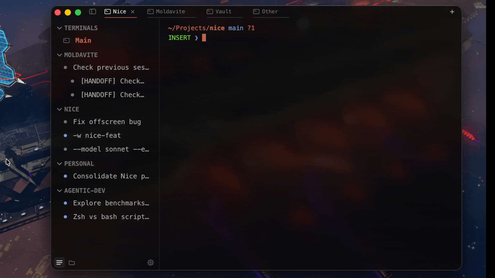
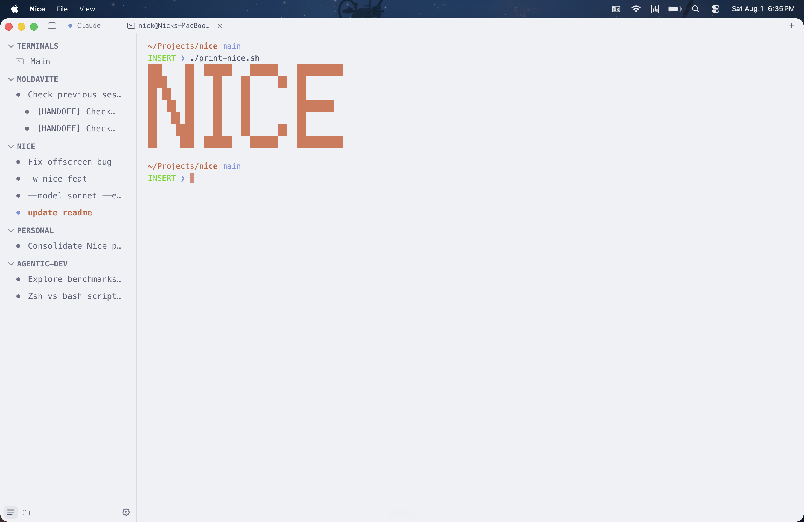
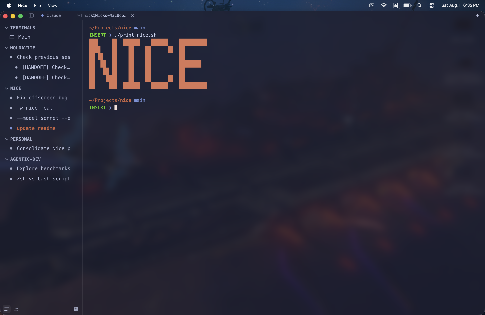

# This is Nice

> **Never lose track of a Claude session again - even between restarts.**

A native macOS terminal that organizes your Claude Code sessions for you. Run `claude` (or `claude -w worktree-name-here`) anywhere — Nice spawns it in a fresh pty and files it under the right project in the sidebar. No config, no setup, no "where did that window go" dance. Sessions persist through restarts — they are reopened with prepopulated `claude --resume id-here` commands.

```sh
brew install --cask Nick-Anderssohn/nice/nice
```

<p align="center">
  
</p>

## Auto-organized sessions

You don't organize your Claude sessions. Nice does.

Type `claude <args>` in any shell, from any project directory — a new session opens in Nice, auto-grouped under the right project, running in its own long-lived pty with a plain shell window alongside.

## The themes are lit 🔥

Twelve built-in terminal themes — Catppuccin (Latte & Mocha), Dracula, Nord, Gruvbox, Tokyo Night, Solarized, Atom One, and more — plus five native-chrome accents (Terracotta, Ocean, Fern, Iris, Graphite) — or pick **From theme** and let the accent follow whatever terminal theme is active, per scheme. Switch live from Settings; the whole window repaints instantly. OS Theme Sync is supported.

Already have a [Ghostty](https://ghostty.org) theme you love? Nice reads Ghostty's theme file format directly. Drop it in and it's a one-click swap.

<table>
  <tr>
    <td width="50%"></td>
    <td width="50%"></td>
  </tr>
  <tr>
    <td align="center"><sub><b>Catppuccin Latte</b></sub></td>
    <td align="center"><sub><b>Catppuccin Mocha</b></sub></td>
  </tr>
</table>

## Keyboard-first

Window navigation is a tmux-style held-modifier scheme: hold `⌃⌘` and use vim
keys — `h`/`l` step the window pills, `j`/`k` step the sidebar sessions. Hold it
for a moment without pressing anything and each window pill shows the digit that
jumps to it.

Adding modifiers climbs a ladder: the modifier set picks the verb, `hjkl` picks
the direction. `⌃⌘` navigates containers, `⌃⌘⇧` moves focus between split panes,
`⌃⌥⌘` resizes them, `⌃⌥⌘⇧` swaps them.

| Shortcut | Action |
|---|---|
| `⌃⌘L` / `⌃⌘H` | Next / previous window within a session |
| `⌃⌘J` / `⌃⌘K` | Next / previous sidebar session (`j` goes down the list) |
| `⌃⌘1`–`⌃⌘9` | Jump to a window by its position |
| `⌃⌘O` | Back to the last window you were in |
| `⌃⌘↑` / `⌃⌘↓` | Half-page through terminal scrollback |
| `⌃⌘-` / `⌃⌘\` | Split the window down / to the right |
| `⌃⌘⇧HJKL` | Move focus to the pane in that direction |
| `⌃⌥⌘HJKL` | Resize the current split in that direction |
| `⌃⌥⌘⇧HJKL` | Swap the focused pane with its neighbor in that direction |
| `⌃⌘Z` | Zoom the focused pane to fill the window (toggle) |
| `⌃⌘B` | Break the focused pane out into a window of its own |
| `⌃⌘C` | Copy mode — vi keys over the pane's scrollback (toggle) |
| `⌃⌘/` | Search the pane's scrollback (opens copy mode with a query) |
| `⌘T` | New terminal window |
| `⌘B` | Toggle sidebar |
| `⌘⇧B` | Toggle sidebar mode (sessions ↔ file browser) |
| `⌘⇧.` | Toggle hidden files in the file browser |
| `⌘+` / `⌘-` / `⌘0` | Zoom in, out, reset |
| `⌘Z` / `⌘⇧Z` | Undo / redo file operation |
| `⇧PgUp` / `⇧PgDn` | Page through terminal scrollback |
| `⇧Home` / `⇧End` | Jump to the top / bottom of scrollback |
| `⌘`+click | Open a URL in the terminal (hold `⌘` to underline it) |

All rebindable in Settings (`⌘,`), except the `⇧`-scrollback keys — those are
terminal-level and fall through to fullscreen apps like vim. `⌃⌘1`–`⌃⌘9` is a
single row there: record any digit and the modifiers you chose apply to all
nine. `⌃⌘↑`/`⌃⌘↓` deliberately do nothing on the alternate screen, so vim and
less keep their own half-page keys.

### Copy mode

`⌃⌘C` puts one pane into copy mode: a keyboard cursor you drive with vi keys,
over that pane's whole scrollback. The pane keeps running — copy mode is a
reader, not a pause — and nothing you type while in it reaches the program.
`⌃⌘/` is the same mode with a search field already open, searching back through
history. Everything is per-pane: the pane beside it still types normally.

| Key | In copy mode |
|---|---|
| `h` `j` `k` `l` (or the arrows) | Move the cursor left / down / up / right |
| `w` `b` `e` | Word forward / back / to word end (`W` `B` `E` for WORDs) |
| `0` / `^` / `$` | Start of line / first non-blank / end of line |
| `H` / `M` / `L` | Top / middle / bottom of the screen |
| `{` / `}` / `%` | Paragraph up / down / matching bracket |
| `g` / `G` | Top of the scrollback / back down to the newest output |
| `⌃U` / `⌃D` | Half page up / down |
| `⌃B` / `⌃F` | Full page up / down |
| `v` / `V` / `⌃V` | Start (or clear) a character / line / block selection |
| `y` or `↩` | Copy the selection and leave copy mode |
| `⌘C` | Copy the selection and stay in copy mode |
| `/` / `?` | Search forward / back through the scrollback |
| `n` / `N` | Next match / previous match |
| `Esc` or `q` | Leave copy mode and jump back to the live output |

The `⇧`-scrollback keys keep working in copy mode too. Leaving always returns
the pane to the bottom of its live output.

## Requirements

- macOS 14 (Sonoma) or later
- zsh or bash; Nice runs your login shell (pick it in Settings ▸ Advanced). Other shells run fine as plain terminals, without Nice's shell integration.
- [Claude Code](https://github.com/anthropics/claude-code) on your `$PATH` — optional; sessions fall back to a plain shell if it's missing

## Install

```sh
brew install --cask Nick-Anderssohn/nice/nice
```

Signed, notarized, universal (Apple Silicon + Intel). `brew upgrade --cask nice` picks up new releases; `brew uninstall --cask --zap nice` removes the app and wipes its settings.

## Built with

Nice is a native Rust app rendered on a single Metal stack:

- [GPUI](https://www.gpui.rs) — the GPU-accelerated UI framework from [Zed](https://github.com/zed-industries/zed). The whole app (chrome, sidebar, and terminal) is drawn GPUI-native; Nice vendors a pinned Zed checkout with a small set of local patches.
- [alacritty_terminal](https://github.com/alacritty/alacritty) — the VT engine (grid, scrollback, damage tracking, and VTE parsing) behind Nice's terminal windows.

Terminal themes are compatible with [Ghostty](https://ghostty.org)'s theme file format.
